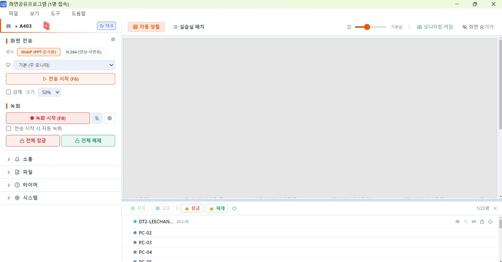

# 화면공유 (Screen Share)

**학교 PC실을 위한 교사-학생 화면 공유 프로그램**

> **이 페이지는 GitHub Releases로 배포되는 화면공유 프로그램의 공식 안내입니다.**
> 교사 PC와 학생 PC에 각각 설치해 사용합니다.

---

## 📸 주요 화면

<table>
<tr>
<td width="50%"></td>
<td width="50%"></td>
</tr>
<tr>
<td align="center"><b>교사 앱 — 학생 모니터링 + 송출 제어</b></td>
<td align="center"><b>학생 앱 — 플로팅 바로 메시지 전송</b></td>
</tr>
</table>

---

## ✨ 주요 기능

### 화면 송출
- **WebP** (PPT·문서·코드 등 정지 화면) / **H.264** (영상·애니메이션·시연) 모드 선택
- 학생 전체 송출 또는 선택 송출
- 일시정지 / 재개
- 글로벌 단축키 (`F6`~`F9`) — PPT 진행 중에도 동작

### 학생 모니터링
- 실시간 썸네일 그리드
- 개별 학생 화면 확대 뷰어
- 원격 제어 (마우스·키보드 + 클립보드 읽기)
- 학생 화면 전체 중계 — 잘한 학생 결과물을 모두에게 보여주기

### 파일 관리
- 📤 **파일 배포** — 개별 또는 전체 학생에게 자료 전달
- 📥 **파일 회수** — 과제 제출 받기. 과제명/날짜로 폴더 자동 정리
- 📋 **텍스트·코드·이미지 전송** — 클립보드 이미지 첨부 가능

### 수업 통제
- 🔒 **잠금 모드** — 학생 PC 입력 차단 + 공지 표시
- 🎯 **집중 모드** — 다른 창 가림
- ⏰ **타이머** — 카운트다운·카운트업, 0초 도달 알림
- 📢 **공지 띄우기**

### 학생 ↔ 교사 소통
- 학생 플로팅 바: 💬 메시지 / ✅ 완료 / ✋ 도움 요청 / 🆘 이상 신고
- 클립보드 이미지·파일 첨부
- 교사 앱에서 받은 메시지 통합 관리

### 보안·안정성
- 워치독: 학생 앱이 비정상 종료되어도 자동 복구
- 잠금 모드 자동 해제 안전망 (교사 PC 비정상 종료 90초 후)
- 학생 우회 시도 차단 (Alt+F4, F12, 작업 종료 등)

---

## 💻 시스템 요구사항

| 항목 | 권장 사양 |
|---|---|
| 운영체제 | Windows 10 / 11 |
| 네트워크 | 1 Gbps LAN (학교 PC실 환경) |
| 교사 PC | RAM 8GB+, 디스크 여유 2GB+ |
| 학생 PC | RAM 4GB+ |

---

## 📦 다운로드

| 어디에 설치? | 어떻게? |
|---|---|
| **교사 PC** | 아래 [Releases](../../releases/latest) 에서 `teacher-Setup-x.x.x.exe` 다운로드 |
| **학생 PC** | 교사 앱의 **도구 → 학생 설치 패키지 만들기** 로 생성한 맞춤 패키지 사용 |

> 학생 앱은 **교사 PC의 IP가 사전 입력된 맞춤 빌드**로만 정상 동작합니다.
> 그래서 학생용 설치 파일은 별도로 제공하지 않고, 교사 PC에서 직접 만들어 배포하는 방식입니다.

---

## 🚀 설치 가이드

### 교사 PC

1. [Releases](../../releases/latest) 에서 `teacher-Setup-x.x.x.exe` 다운로드
2. 실행 → 설치 마법사 따라 진행
3. 교사 앱 실행
   - 첫 실행 시 Windows 방화벽 허용 다이얼로그가 뜨면 **허용**

### 학생 PC (교사 앱 설치 후 진행)

1. 교사 앱 메뉴 → **도구 → 학생 설치 패키지 만들기**
2. 교사 PC의 IP·포트를 확인하고 패키지 생성
3. 생성된 학생 설치 파일을 학생 PC들에 배포:
   - USB로 직접 복사
   - 네트워크 공유 폴더
   - 학교 PC실 자동 배포 도구 (Ghost 등)
4. 학생 PC에서 패키지 실행 → 자동으로 교사 앱에 연결됨

> 학생 앱은 자동 시작 등록되어 학생 PC 부팅 시 자동 실행됩니다.

> Windows SmartScreen 경고가 뜨면 **"추가 정보 → 실행"** 을 눌러 진행하세요.

---

## ⚡ 빠른 시작

1. **교사 앱 실행** → 좌측 사이드바에 접속한 학생 목록이 표시됩니다
2. **사이드바 → 전송 시작** (또는 `F6`) → 교사 화면이 학생들에게 송출됩니다
3. 학생들은 자기 화면 우하단에 작은 뷰어로 교사 화면을 봅니다

---

## ⌨️ 단축키 (교사 앱)

| 키 | 동작 | 비고 |
|---|---|---|
| `F6` | 전송 시작 / 종료 | 어느 앱이 활성이든 동작 |
| `F7` | 전송 일시정지 / 재개 | WebP 모드 한정 |
| `F8` | 녹화 시작 / 종료 | |
| `F9` | 녹화 일시정지 / 재개 | |

단축키는 **도구 → 단축키 설정** 에서 변경할 수 있습니다.

---

## 📝 변경 이력

자세한 변경 사항은 [Releases](../../releases) 를 참고하세요.

### 최근 주요 업데이트
- **v0.1.53 (교사)** — 클립보드 요청 메모리 위생
- **v0.1.52 / v0.2.58** — 원격제어 클립보드 읽기 + 교사 PC 자동 복사
- **v0.1.50** — 회수 모달 UX 개선 (종료/재시작 흐름)
- **v0.1.49** — 학생 메시지 모달 UX 전면 개선
- **v0.1.48 / v0.2.52** — 받은파일·회수 폴더 구조 정비

---

## ❓ 자주 묻는 질문

<b>학생 PC 설치 파일은 왜 따로 다운로드 받을 수 없나요?</b>

학생 앱은 어느 교사 PC에 접속할지 미리 알아야 동작합니다. 교사 PC의 IP는 학교마다 다르기 때문에, 교사 앱이 자신의 IP를 박은 맞춤 학생 패키지를 생성해 배포하는 구조입니다.

`도구 → 학생 설치 패키지 만들기` 메뉴에서 만들 수 있습니다.

<b>학생이 임의로 종료할 수 있나요?</b>

작업 표시줄·트레이에 노출되지 않고, `Alt+F4`·작업 관리자 종료 등 일반적인 우회는 차단되어 있습니다. 다만 관리자 권한으로는 종료 가능합니다.

<b>인터넷 연결이 필요한가요?</b>

학생-교사 간 통신은 모두 학교 LAN 안에서 이뤄집니다. 인터넷은 업데이트 확인·다운로드 시에만 필요합니다.

<b>녹화 파일은 어디 저장되나요?</b>

기본값은 `C:\Screen_Share\녹화\` 입니다. 설정에서 변경할 수 있습니다.

<b>학생 PC가 여러 교실로 나뉘어 있어도 한 교사가 모두 관리할 수 있나요?</b>

같은 LAN에 있으면 가능합니다. 다만 정상 운영은 한 교실 단위(약 25명 이하)를 권장합니다. 여러 실은 각 실의 교사 PC가 자기 실만 관리하는 구조가 자연스럽습니다.

---

## 🛠️ 개발

- **스택**: Electron · React · TypeScript · Tailwind CSS
- **빌드**: `electron-builder` + NSIS 설치 마법사
- **인코딩**: 자체 WebP / FFmpeg H.264

---

## 📄 라이센스

본 프로그램은 **교육 목적의 비상업적 사용**에 한해 무료로 이용할 수 있습니다.

- ✅ 학교·학원·교육 기관에서 수업·실습 용도로 사용
- ✅ 개인 학습 용도로 사용
- ❌ 영리 목적 사용·판매·재배포 금지
- ❌ 역공학(reverse engineering), 수정 배포 금지

---

**개발: 세명컴퓨터고등학교 이창환**

문의·버그 제보는 [Issues](../../issues) 에 등록해 주세요.

